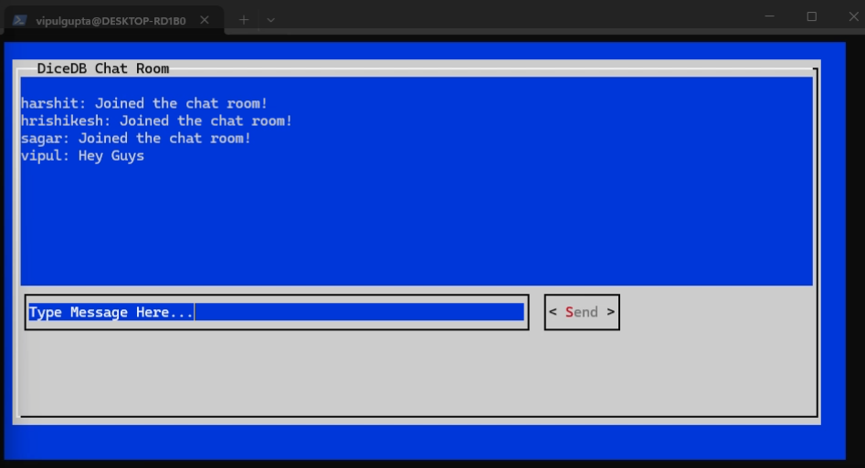

# DiceDB Java Chatroom

A terminal-based chatroom application built in Java using [DiceDB](https://github.com/DiceDB/dice) and the [DiceDB-Java SDK](https://github.com/bipoool/dicedb-java). Each instance of the application connects to a shared DiceDB backend and communicates in real-time through a simple terminal interface.

---

## ⚙️ Requirements

- Java 21
- Maven (use included `mvnw` wrapper)
- DiceDB running locally on port `7379`

> Make sure DiceDB is up and running before you start the application.  
> Refer to [DiceDB README](https://github.com/DiceDB/dice/blob/master/README.md) for setup instructions.

---

## 🚀 Running the Application

### Using JAR

To build and run the JAR:

```bash
# Step 1: Build the jar
./mvnw clean install

# Step 2: Run the jar with a username
java -jar target/chatroom.jar <username1>
java -jar target/chatroom.jar <username2>
```

### Using Docker

To build and run the Container:

```bash
# Step 1: Build the jar
./mvnw clean install

# Step 2: Run DiceDB docker container first
docker-compose up -d dicedb

# Step 3: Run Container for each chatroom session
docker-compose run chatroom username1
docker-compose run chatroom username2
```

### Using IntelliJ (Not in windows)

```text
Just run the `main` method in the `Main` class with your desired username passed as an argument.
```

## 💬 Interface Instructions

```text
1. A popup terminal window will appear.

2. Type your message in the input box.

3. Use the Left Arrow Key to shift focus to the Send button.

4. Press Enter to send the message.

5. Write 'exit' to leave the chatroom.
```

## 📸 Screenshots


## Want to contribute?
```
If you have suggestions or improvements, feel free to open an issue or submit a pull request. Your feedback is always welcome!
```